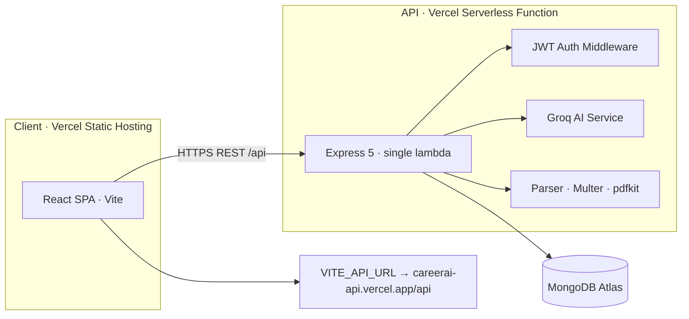
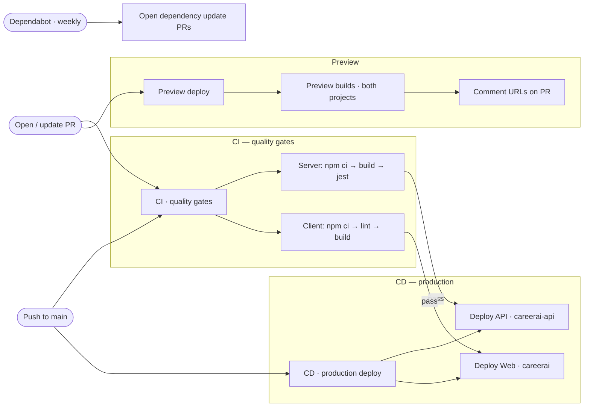

# CareerAI

> AI-powered career growth platform — resume scoring, ATS checks, job matching, roadmaps, mock interviews, and application tracking.

[](https://github.com/sharanulkaveri77-op/CAREERAI/actions/workflows/ci.yml)
[](https://github.com/sharanulkaveri77-op/CAREERAI/actions/workflows/cd.yml)
[](https://github.com/sharanulkaveri77-op/CAREERAI/actions/workflows/preview.yml)
[](https://github.com/sharanulkaveri77-op/CAREERAI/security/dependabot)
[](https://nodejs.org)


---

## Table of Contents

- [Features](#features)
- [Tech Stack](#tech-stack)
- [Architecture](#architecture)
- [Getting Started](#getting-started)
- [CI/CD Pipeline](#cicd-pipeline)
- [Deployment](#deployment)
- [Testing](#testing)
- [Project Structure](#project-structure)
- [Documentation](#documentation)

---

## Features

| Module | Description |
| --- | --- |
| **Resume Parsing & AI Scoring** | Upload PDF/DOCX — parsed, scored, with rewritten bullets and section feedback from Groq (Llama 3.3 70B). Raw text is cached for reuse across modules. |
| **ATS Compatibility Checker** | Deterministic audit of parseability (contact info, sections, length, action verbs) plus AI keyword extraction against a target job description. |
| **Smart Job Matching** | Vector embeddings + cosine similarity against a seed job catalog, with per-job skill-gap analysis feeding your AI roadmap. |
| **AI Career Roadmaps** | Month-by-month study plans with checkable tasks; progress persists and feeds the analytics dashboard. |
| **Mock Interview Simulator** | Chat-based interview room where the AI acts as a recruiter, asks follow-ups, and scores each answer. |
| **Application Tracker** | Drag-and-drop Kanban — Saved → Applied → Interviewing → Offer → Rejected — with one-click tracking from matched jobs. |
| **Gamification** | XP, levels, daily streaks, and 13 badges awarded server-side across every module. |
| **PDF Export** | Styled PDF reports for resume analysis (with ATS audit) and career roadmaps. |
| **Premium Analytics** | Recharts dashboard: scores, roadmap progress, and interview performance over time. |

## Tech Stack

| Layer | Technology |
| --- | --- |
| **Frontend** | React 19 · TypeScript · Vite · Tailwind CSS · Zustand · Recharts · Lucide · @dnd-kit |
| **Backend** | Node.js 22 · Express 5 · TypeScript · MongoDB (Mongoose) · JWT · Multer · pdfkit |
| **AI** | Groq — Llama 3.3 70B (deep reasoning) · Llama 3.1 8B (fast calls) · deterministic mock fallbacks so the app runs offline |
| **CI/CD** | GitHub Actions · Vercel (serverless functions + static hosting) |
| **Testing** | Jest + ts-jest (server) · oxlint (client) |

## Architecture



Every AI call falls back to deterministic mock logic when `GROQ_API_KEY` is absent, and the API falls back to an in-memory MongoDB for local development when no URI is configured.

## Getting Started

### Prerequisites

- Node.js v18+ (Node 22 recommended — `.nvmrc`)
- MongoDB — local or Atlas *(optional in dev: in-memory fallback)*
- Groq API key *(optional in dev: mock AI fallback)*

### Installation

```bash
# 1. Clone
git clone https://github.com/sharanulkaveri77-op/CAREERAI.git
cd CAREERAI

# 2. Install dependencies
cd client && npm install
cd ../server && npm install

# 3. Configure environment
# Create server/.env (see server/.env.example):
#   PORT=5000
#   MONGODB_URI=mongodb+srv://<user>:<pass>@<cluster>.mongodb.net/?retryWrites=true&w=majority
#   JWT_SECRET=<random 64-char string>
#   GROQ_API_KEY=gsk_...
# Create client/.env.local:
#   VITE_API_URL=http://localhost:5000/api

# 4. Run both dev servers
cd server && npm run dev        # Terminal 1 → http://localhost:5000
cd client && npm run dev        # Terminal 2 → http://localhost:5173
```

Open `http://localhost:5173`, register an account, then hit **Seed Sample Jobs** in the Job Matcher.

## CI/CD Pipeline

Automated quality gates and deployments run through GitHub Actions on every change:



> **Gate:** CD and Preview jobs run only when the `VERCEL_TOKEN` secret exists. Until then they skip gracefully and CI stays green.

| Workflow | Trigger | Steps | Artifact |
| --- | --- | --- | --- |
| **CI** | push/PR to `main` | Server: `npm ci` → `build` → `jest` · Client: `npm ci` → `lint` → `build` | Test + build verification |
| **CD · Production Deploy** | push to `main` | `vercel build --prebuilt --prod` on both projects | Live production URLs |
| **Preview Deploy** | PR opened/synced | Preview builds + URL comment on PR | Per-PR staging URLs |
| **Dependabot** | weekly | npm + GitHub Actions dependency scan | Update PRs |

### Enable auto-deploys (one-time)

1. Create a token → https://vercel.com/account/settings/tokens (e.g. `CareerAI CI`).
2. Add it as a repo secret:
   ```bash
   gh secret set VERCEL_TOKEN
   ```
   (or GitHub → **Settings → Secrets and variables → Actions**).
3. Push to `main` — CI runs, then CD auto-deploys both projects; every PR gets preview URLs.

Org ID and both project IDs are already embedded in the workflows — no other configuration is needed.

## Deployment

Live on Vercel as two projects:

| Project | URL | Notes |
| --- | --- | --- |
| **API** (Express → single lambda) | https://careerai-api.vercel.app | `server/vercel.json` — `builds` + catch-all `routes` so every `/api/*` path hits one function |
| **Web** (Vite SPA) | https://careerai-alpha.vercel.app | `client/vercel.json` — SPA rewrite for deep links |

**Required environment variables**

- API project: `MONGODB_URI`, `JWT_SECRET`, `GROQ_API_KEY`
- Client project: `VITE_API_URL=https://careerai-api.vercel.app/api`

Manual redeploy from either directory:

```bash
cd server && vercel --prod --yes
cd client && vercel --prod --yes
```

## Testing

```bash
cd server && npm test        # 37 Jest tests: ATS rules, embeddings, gamification, PDF builders
cd client && npm run lint    # oxlint
cd client && npm run build   # tsc + vite production build
```

## Project Structure

```
.
├── client/                 # React 19 SPA (Vite + Tailwind)
│   ├── src/features/       # Feature modules (resume, jobs, roadmap, interview, applications)
│   └── vercel.json         # SPA rewrites
├── server/                 # Express 5 API (TypeScript)
│   ├── src/
│   │   ├── config/         # DB & env wiring
│   │   ├── controllers/    # Route handlers
│   │   ├── middlewares/    # JWT, upload (multer)
│   │   ├── models/         # Mongoose schemas
│   │   ├── routes/         # Express routers
│   │   └── services/       # Groq AI, parsers, embeddings, gamification
│   ├── api/index.ts        # Vercel serverless entry
│   └── vercel.json         # build + catch-all route
└── .github/workflows/      # CI · CD · Preview · Dependabot
```

## Documentation

- `ARCHITECTURE.md` — system design and data flows
- `PROGRESS.md` — per-phase build notes and manual test checklists
- `DECISIONS.md` — rationale behind key architectural choices
- `deployment_checklist.md` — full launch guide (Atlas setup, Vercel, verification)